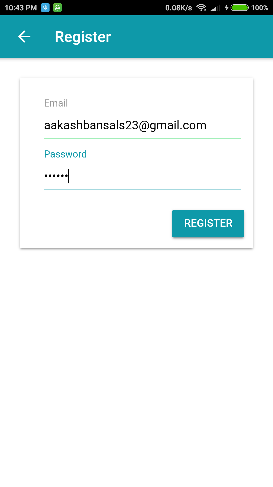
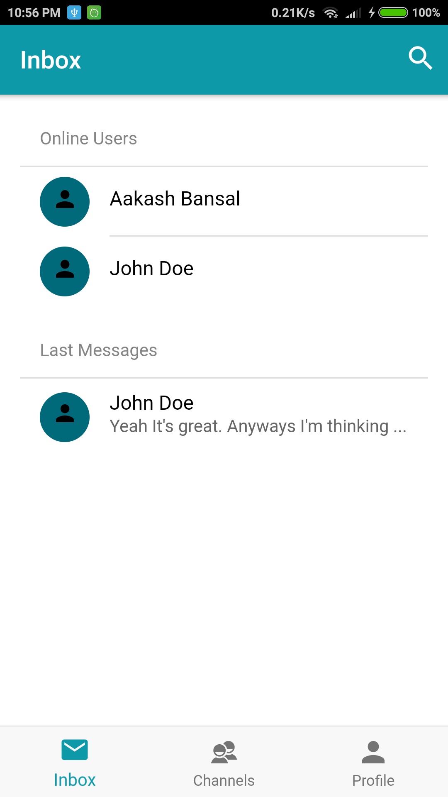
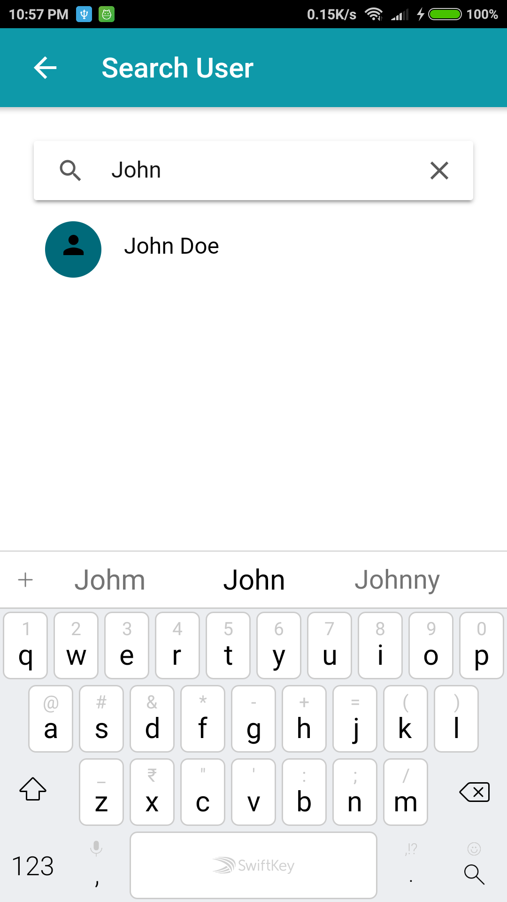
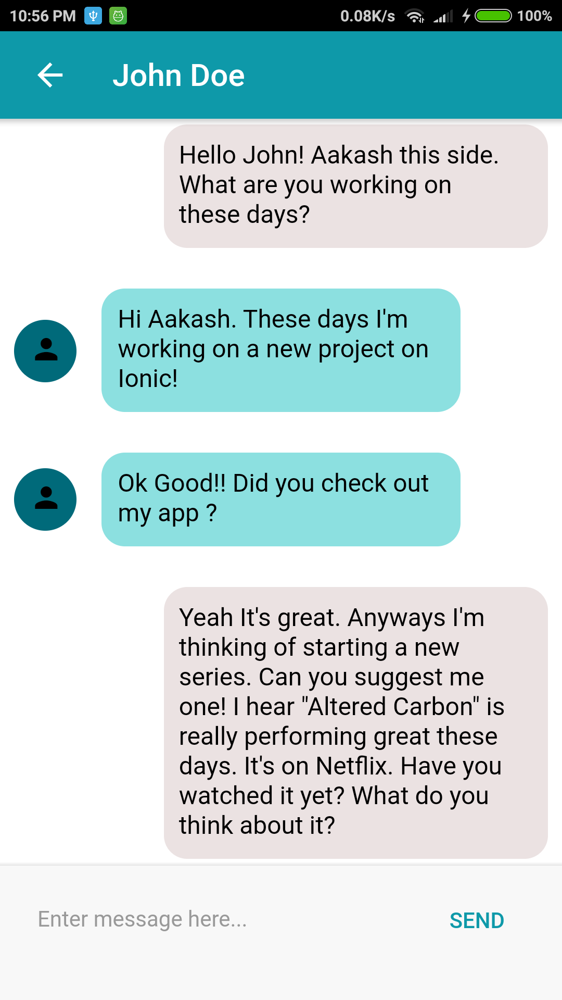
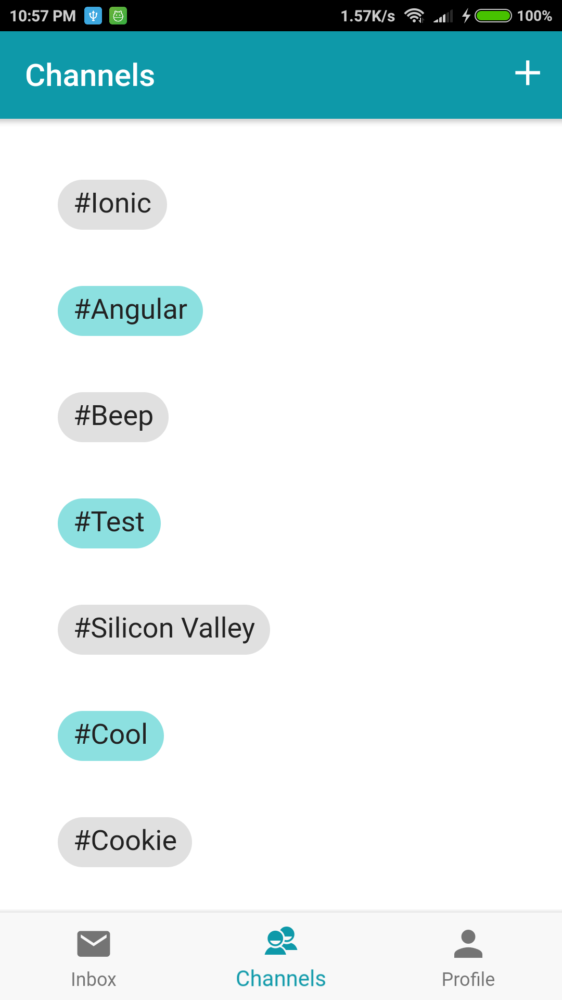
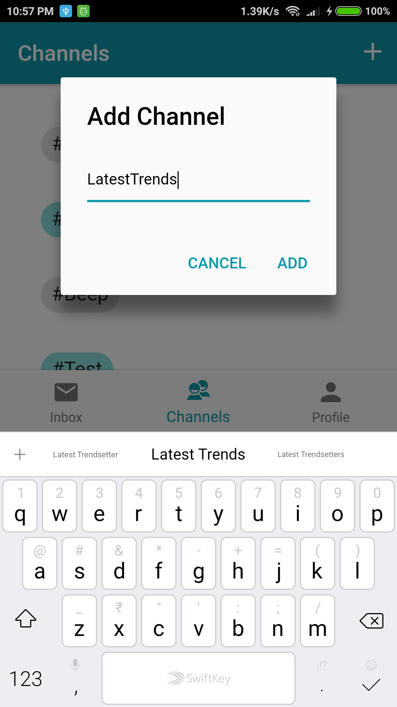
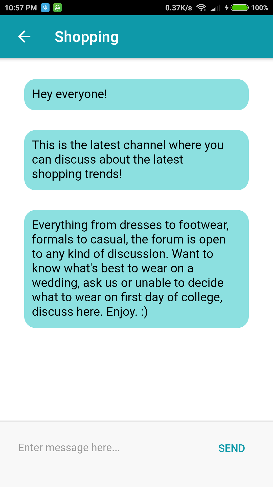
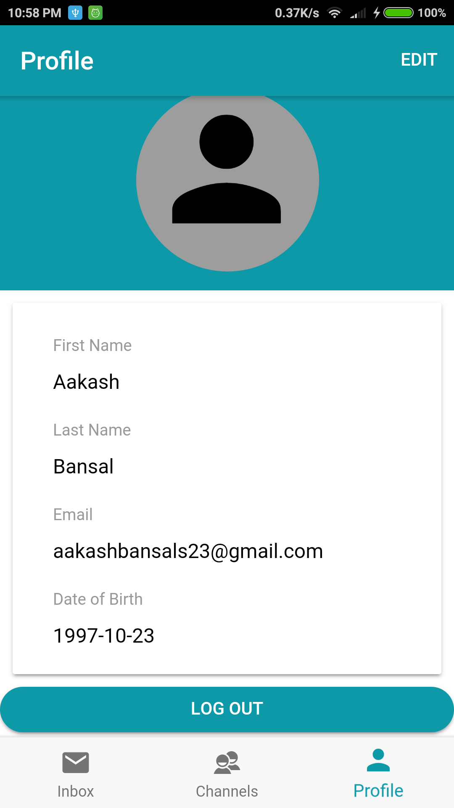
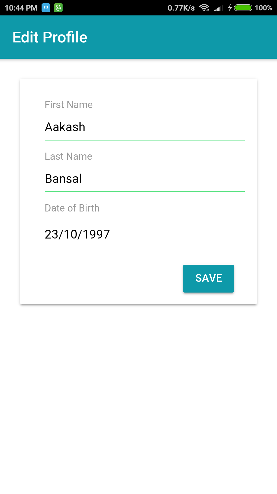

# Beep-chat-app-Ionic-app

The given repository is a **Chat application** built in **Ionic framework** using **Firebase** for **authentication** and **database**.

The app supports **One-to-One Chats** and also has a feature to add **Channels** and carrying on a discussion over a particular topic on that channel. 

## App Screenshots

**Registering and Login**

   


**Inbox and Personal Chat**

   


**Channels & Channel Chats**

   


**Profile-View and Edit**

  


## Project Setup

The following project requires **Node.Js** and **NPM** to be pre-installed and the necessary path variables for **Node** and **NPM** should also be set-up already.

Besides that **Android SDK** and **JAVA JDK** must also be installed before-hand and available in the **system path** for this **Ionic** app to work.

For detailed instructions on how to do that, following articles can be referred : 

[Android Platform Guide by Cordova(Official Guide)](https://cordova.apache.org/docs/en/latest/guide/platforms/android/) or

[Environment setting tutorial Ionic + Android on windows (Blog post)](http://www.tiagoporto.com/blog/environment-setting-tutorial-ionic-android-on-windows/)

Once the above required dependencies are successfully installed, open the terminal/command-line and then : 

First install **Cordova** and **Ionic**.

```
$  npm install -g cordova
$  npm install -g ionic
```
Then set-up the project:
```
$ cd \<required-directory>
$ git clone https://github.com/aakashbansal/Beep-chat-app-Ionic-app.git
$ cd \Beep-chat-app-Ionic-app
$ npm install
```

This sets-up the project locally on your machine.

## Setting up Firebase for this Project

See this [Official Firebase Documentation](https://firebase.google.com/docs/web/setup) for getting familiar on how to set up **Firebase** for this app. 


### Initializing Developer Keys

After setting up the **Firebase** project on the **console**, just copy and paste the **config** object from the **Firebase console** into the following directory :  **src/config/firebase.config.ts** 

This initializes the **Developer keys** for the project.

### Setting up Database Rules

Now, go to the **Firebase console** of the above set-up project . The URL would be something like : 

https://console.firebase.google.com/project/<YOUR_PROJECT_ID>/overview

On this webpage, Select **Database** option. Then select the **RULES** tab.

In this new window, copy and paste the exact contents of this **.txt** file :

**src/config/firebase.database.rules.txt** 

Then click **PUBLISH** button. Wait for the changes to be published. 

This establishes the rules for accessing the database by the app.


### Setting Up Cloud Functions

For a detailed explaination on how to set up **Firebase Cloud Functions** for any project , see [FIREBASE Official Docs : Cloud Functions](https://firebase.google.com/docs/functions/get-started).

**Or follow along this step-by-step guide :**

In the **root** app directory, go to **/functions** directory . Inside this **/functions** directory, run the following command in the terminal : 
```
$ npm install
```
This installs the dependencies for Cloud functions.

Now, install the **firebase-tools** package globally to get **firebase** in the **command-line**.
```
$ npm install -g firebase-tools
```

Then, run the following command to login into the **Firebase account** via browser and authenticate the firebase tool :
```
$ firebase login
```

Now, here comes the final step for deploying the functions to **Cloud** :
```
$ firebase deploy --only functions
```

This finishes the final stage for setting up **firebase** for the project i.e. **Deploying Cloud Functions**.


**IMPORTANT NOTE :** It is possible that for **cloud functions deployment**, even after following all the above steps properly and in order, the functions deployment may still not work. To deal with this issue, remember that just the file **index.js** in **/functions** directory contain the code for our business logic . Rest of the files/folders are created automatically by **Firebase** and only contain the boiler-plate code. So, make a copy of **index.js** in a different directory. Then completely delete **/functions** directory and set up **FIREBASE Cloud Functions** from scratch by referring [this](https://firebase.google.com/docs/functions/get-started).
After everything is done, just replace the contents of **index.js** in the **/functions** directory created now with the earlier saved copy and run the following command in terminal :
```
$ firebase deploy --only functions
```

This would deploy our version of **Firebase functions** to **cloud**.

The project is good to go now.

## Running the App

To run the app in **Browser** :
```
$ ionic lab
```

To run the app on an **Android Device** :
```
$ ionic cordova platform add android
$ ionic cordova run android
```

To run the app on **Android Emulator** :
```
$ ionic cordova platform add android
$ ionic cordova emulate android
```
